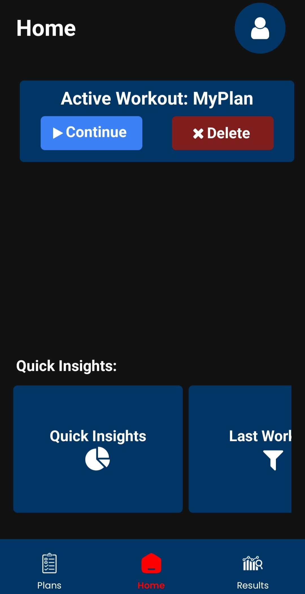
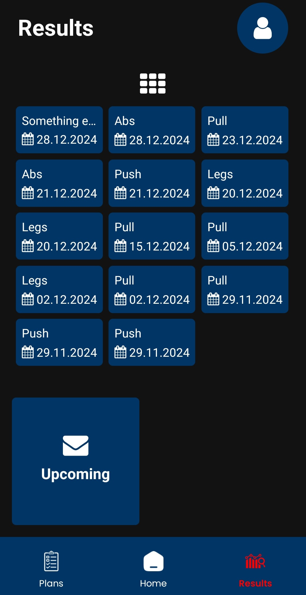
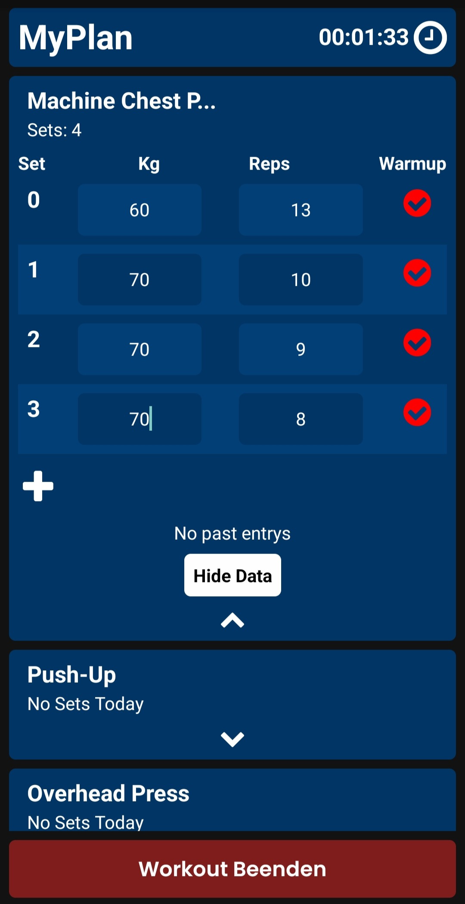
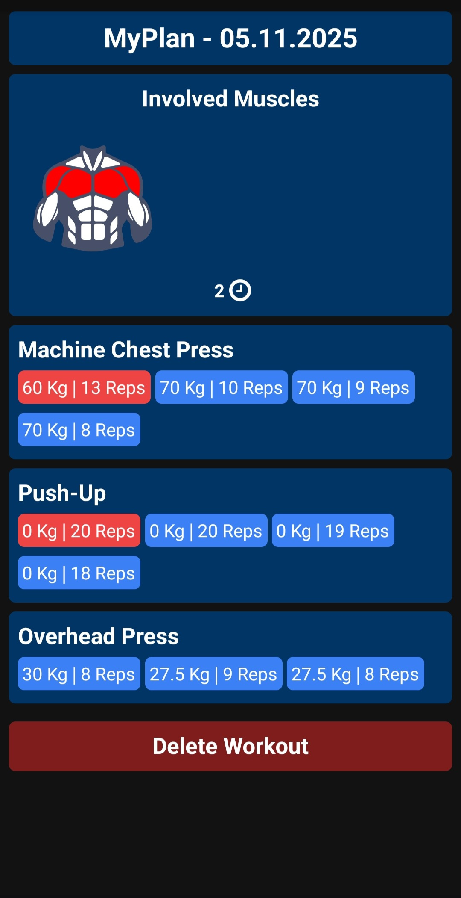
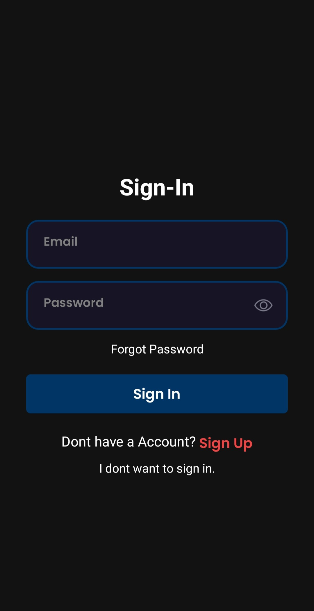

#  03-Fitness

> **Note:** This project is no longer actively maintained. You can use it for UI inspiration or as a starting point for your own fitness tracking app.

03-Fitness is an app for tracking your workouts.  
You can create, execute, and review workouts, distinguishing between warmup and normal sets. After each workout, an SVG visualization shows which muscles you trained. The home screen displays ongoing workouts and statistics about your recent activity (week/month).

## Features

- Create and manage custom workouts
- Execute workouts with warmup/normal set distinction
- SVG muscle map after each workout
- Home screen with statistics and ongoing workout info
- View past workouts in a summarized or detailed view
- Optional Appwrite login for cloud sync (see limitations below)
- Works offline with Async Storage if you skip login

## Screenshots

<!-- Gallery with fixed image sizes for better overview -->
<table>
  <tr>
    <td align="center" style="vertical-align:top;">
      
    </td>
    <td align="center" style="vertical-align:top;">
      
    </td>
    <td align="center" style="vertical-align:top;">
      
    </td>
    <td align="center" style="vertical-align:top;">
      
    </td>
    <td align="center" style="vertical-align:top;">
      
    </td>
  </tr>
</table>

<p style="font-size: 0.95em; color: #555; margin-top: 8px;">
  <i>The screenshots are scaled down to a fixed width (200px) and arranged side by side. Shown are: home screen (1), list of past workouts (2), live workout (3), past workout details (4), and login screen (5).</i>
</p>


<!--
Example for adding more screenshots:
- ./bild6 - Example of the settings screen
-->

## Limitations & Self-Hosting

The Appwrite database used in the script is currently **disabled** due to new policy restrictions (only 2 projects allowed on the free plan).  
**Self-hosting** is easy: just create the required collections in your own Appwrite instance.

The app also works without Appwrite:  
Simply choose "I don't want to sign in" at login. The app will use Async Storage for local data.  
**Note:** Without Appwrite, data cannot be transferred between devices (import/export features are not implemented yet).

## Getting Started

To run or test the project locally:

```bash
npm install
npx expo start -w
```

To build an APK for Android:

```bash
eas build -p android --profile production
```

**[⬇️ Download latest APK](./additional-media/application-d7eda7ab-03c5-4fdf-943c-c666c6a76d67%20(1).apk)** <!-- Place your built APK as 03-fitness-latest.apk in the same folder -->

---
